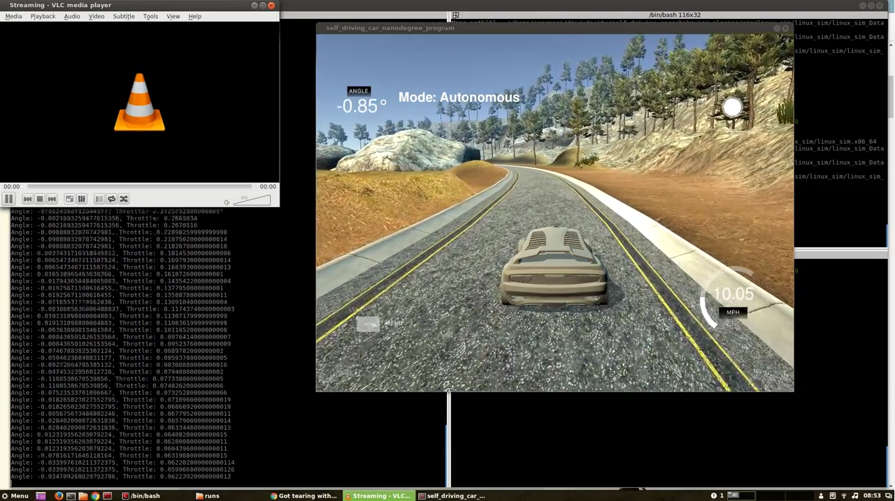
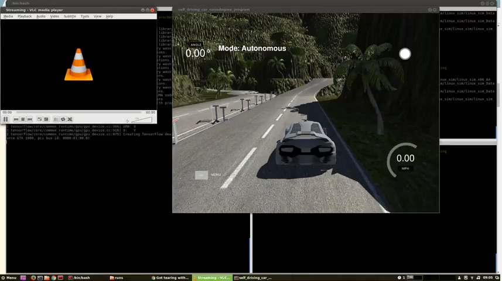

# Behavioral Cloning
---
[//]: # (Image References)

[sample_data_distribution]: ./report_imgs/sample_data_distribution.png "Udacity's Sample Data Distribution"
[track1_data_distribution]: ./report_imgs/track_1_data_distribution.png "Track 1 Data Distribution"
[track2_data_distribution]: ./report_imgs/track_2_data_distribution.png "Track 2 Data Distribution"
[combined_data_distribution]: ./report_imgs/combined_data_distribution.png "Combined Data Distribution"
[network_architecture]: ./report_imgs/model.png "Nvidia Model"
[track1_conv2d_5_layer]: ./report_imgs/track1_conv2d_5_layers.gif "Track 1 Conv2d_5"
[track2_conv2d_5_layer]: ./report_imgs/track2_conv2d_5_layers.gif "Track 2 Conv2d_5"
[track2_final_run]: ./report_imgs/track2_final_run.gif "Track 2 Final Run"

[image2]: ./examples/placeholder.png "Grayscaling"
[image3]: ./examples/placeholder_small.png "Recovery Image"
[image4]: ./examples/placeholder_small.png "Recovery Image"
[image5]: ./examples/placeholder_small.png "Recovery Image"
[image6]: ./examples/placeholder_small.png "Normal Image"
[image7]: ./examples/placeholder_small.png "Flipped Image"

After tackling the lane line detection and the traffic sign classification projects from Udacity, the third project to be tackled was another completely different project in terms of what it achieves. The project was centered around the concept of Behavior cloning which meant that we teach a Neural Network model to do a certain task by showing it how it is to be done. The concept is very similar to how you teach babies or even adults in some cases to do certain things.

The theme of this project was to train a car to drive by itself autonomously. Udacity provided a simulator built in **Unity** for this purpose. The simulator has two tracks and has two modes it could work on.

## Simulator Modes
- Training Mode: In the training mode the car has to be manually driven and the driving data was stored.
- Autonomous Mode: In the Autonomous mode, a Flask server was run which would use a socket connection to the simulator and then pass in the steering angles and the throttle values to the simulator. The **Steering Angles** are predicted whereas the throttle values are calculated with a Simple PI Controller.

## Tracks
### Track 1
This track was supposed to be both the training and the testing track. This meant that initially we were supposed to drive the car around on this track like its a game. Once the data is saved for this, this is passed on to a Neural Network to predict the steering angles. The goal was to make the car drive around on this track without going offroad.

#### Salient Features
- Track was **Flat**
- Favored Left Turns more than Right turns and had a lot of straight road driving.
- Has a Bridge & Rocks
- Has an evening kind of lighting

### Track 2
This was meant to be a challenge track and this was much different than Track 1. This was the challenge track and the idea for this was that once the car was trained on track 1 then how it behaved on Track 2.

#### Salient Features
- Track has many up's and down's like a roller coaster.
- High speed Driving is much tougher on this than Track 1 because of up's and down's.
- Sharp turns present while going up and down.
- Obstacles on side of road are new as compared to Track 1
- Has a center line divide which is absent on Track 1

# Data Format from Training

While training the simulator, it asks for a location to save the data. The way the data is stored is like this. There is a **driving_log.csv** which gets generated and an **IMGS** folder. The IMGS folder stores the per frame image from the driving. The way the csv is organized is shown below.

| center image                         |  left_image                        |  right image                       |  steering_angle |  throttle |  brake |  speed     |
|----------------------------------------|--------------------------------------|--------------------------------------|-------------------|-------------|----------|--------------|
| IMG/center_2016_12_01_13_30_48_287.jpg | IMG/left_2016_12_01_13_30_48_287.jpg | IMG/right_2016_12_01_3_30_48_287.jpg |     0             |     0       |     0    |     22.14829 |

## Data Exploration

### Sample Data from Udacity
Udacity provided sample data for people to train their network on. This consisted primarily of driving on Track 1. This is how the data looks when loaded.

| steering_angle |      throttle      |         brake |         speed |               |
|----------------|--------------------|---------------|---------------|---------------|
| count          |      8036.000000   |   8036.000000 |   8036.000000 |   8036.000000 |
| mean           |          0.004070  |      0.869660 |      0.001970 |     28.169839 |
| std            |           0.128840 |      0.301326 |      0.036565 |      6.149327 |
| min            |          -0.942695 |      0.000000 |      0.000000 |      0.502490 |
| 25%            |           0.000000 |      0.985533 |      0.000000 |     30.183093 |
| 50%            |           0.000000 |      0.985533 |      0.000000 |     30.186400 |
| 75%            |           0.000000 |      0.985533 |      0.000000 |     30.186640 |
| max            |           1.000000 |      0.985533 |      1.000000 |     30.709360 |

![alt text][sample_data_distribution]

### Training Data from Manual Training
### Dataset Augmentation

Data Augmentation is a big part of the experiments we carry out with this project. Although,
gathering training data is not very difficult with the simulator, still driving around laps
after laps on the simulator can become cumbersome.

I realized early on that even though the 0 steering angle had a major predominance in this training data yet throwing it away wasn't necessary. So the techniques I tried are listed
below.
- Flip the center image & the steering angle
- Generate about 20 times the data by changing brightness of all center, left & right images for steering angles less than -0.025 and greater than 0.025.

Since this would have been a lot of data all the augmentation was done while the network was running. I used Pandas DataFrames to generate augmentation by storing columns with the augmentation techniques and during training these were read and the techniques applied appropriately.

#### Track 1 - Fastest Mode (Less Graphics)
I drove around 2 laps on this track along the straight path and then took a U-turn to drive around in the reverse direction for 2 more laps.
The data distribution for this data looked like this looked very similar to the sample training data provided since the road architecture is still the same.

#### Track 1 - High Graphics Mode
Similar to the first training data I trained 4 laps on the same track to account for better graphics, shadows etc on this track. Again the data distribution doesn't change with this graphics mode.

![alt text][track1_data_distribution]

#### Track 2 - Data Distribution

![alt text][track2_data_distribution]

#### Combined Data Distribution
Finally I combined all these training data into a single dataset to see how the car performed but before I did that I wanted to visualize what that data looked like so that I get a good idea of what biases it has.

![alt text][combined_data_distribution]

# Network Selection
After reading a lot of material, I decided to use the Nvidia Model for this behavior training. Comma.ai also has a model which is a good model to be used for this purpose. However, I made a few modifications to the Nvidia model to suit it for this project.
I also used a BatchNormalization layer after the Lambda layers. Along with that I also used L2 regularization on the layers which is not used on the nvidia model. The reason for doing this was because early on I found that since the track was relatively straight on track1 and the scenery was relatively similar, overfitting was happening very soon. It was important to keep it down.

# Network Architecture
![alt text][network_architecture]

# Overfitting
One of the biggest problem with this particular project was the overfitting. Within a very few epochs, the network would start overfitting.

# Layer Visualization
## Track 1

 

## Track 2
![alt text][track2_final_run] ![alt text][track2_conv2d_5_layer]

# Final Results
## Track 1

## Track 2

## References:
- https://medium.com/@ValipourMojtaba/my-approach-for-project-3-2545578a9319
